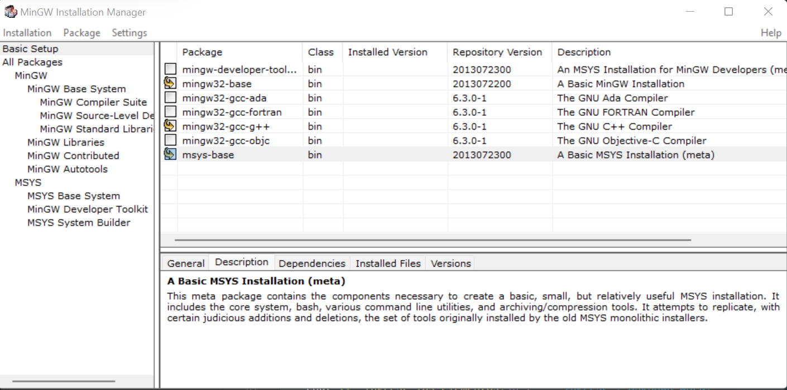
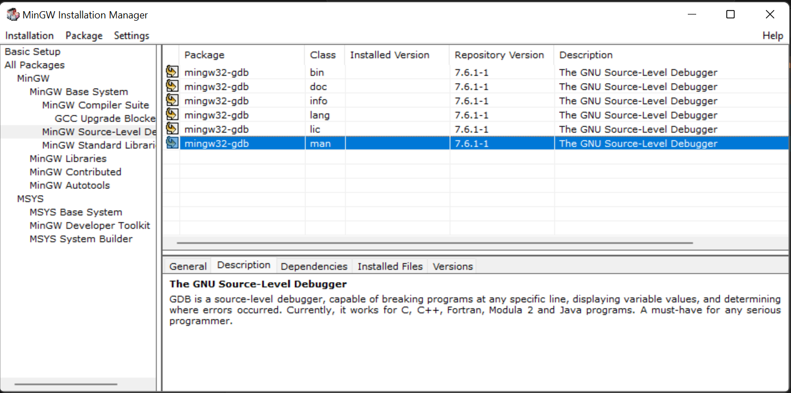

## Que debo instalar?

## Para compilar 
`g++ -o ejercicio.exe ./Practico-1/ejercicio.cpp`

## Para probarlo 
`./Practico-1/ejercicio.exe < ./Practico-1/Pruebas/1000000s.in.txt > ./Practico-1/Pruebas/1000000s3a.xp.txt`

## Para probarlo y ver los tiempos
`time ./Practico-1/ejercicio.exe < ./Practico-1/Pruebas/1000000s.in.txt > ./Practico-1/Pruebas/1000000s3a.xp.txt`

## Para comprobar la diferencia de los archivos 
`diff --strip-trailing-cr prueba.out.txt prueba.mine.txt`

## Para poder debbugear 
`g++ -g .\Practico-1\ejercicio.cpp`
#### tambien necesitan tener esta [extension](https://marketplace.visualstudio.com/items?itemName=ms-vscode.cpptools) si o si